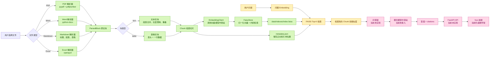
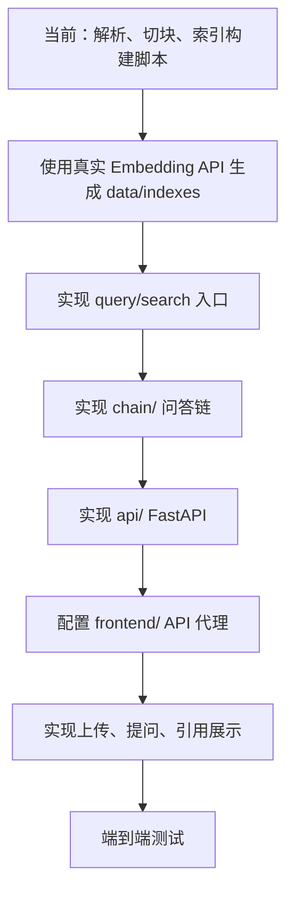

# DocuCite 当前进度

本文记录项目截至 2026-09-15 的代码状态、数据流和下一步实现顺序。

## 一、当前结论

项目已经完成文档问答系统的“数据准备和向量索引基础层”：

```text
文件
  -> 统一解析
  -> ParsedBlock 原文块
  -> Chunk 检索切片
  -> Embedding 向量
  -> FAISS + metadata 持久化
```

目前还不能通过 HTTP 上传文件、提问并返回答案。原因是问答链、FastAPI 接口和前端业务页面尚未实现。

## 二、完整目标流程

下面的流程图同时标出了已经完成和待实现的部分：



图中绿色部分已经有代码；黄色部分需要在索引和问答层之间补上查询入口；粉色部分是后续主任务。

## 三、已实现模块

### 1. 数据模型：`backend/docucite/schemas.py`

这是所有模块共享的数据约定。

| 模型 | 作用 | 关键字段 |
|---|---|---|
| `Document` | 一份上传文件的身份信息 | `doc_id`、`filename`、`file_type` |
| `Location` | 原文位置和引用信息 | `page`、`heading_path`、`paragraph_index`、`table_index`、行号 |
| `TableData` | 矩形表格结构 | `header`、`rows` |
| `ParsedBlock` | 解析器输出的原文块 | `kind`、`text`、`table`、`location` |
| `Chunk` | 用于 Embedding 和检索的切片 | `text`、`source_block_ids`、`location` |

模型使用 Pydantic 校验：

- 位置编号从 1 开始；
- 空字符串、非法文件类型和额外字段会被拒绝；
- 文本块不能携带表格；
- 表格块必须携带结构化表格；
- 表格每一行的列数必须一致；
- 切片必须保存至少一个不重复的来源块 ID。

### 2. 解析层：`backend/docucite/ingest/`

统一入口是：

```python
from docucite.ingest import parse_document

document, blocks = parse_document("../data/samples/markdown/example.md")
```

解析器按照文件扩展名选择实现：

| 文件 | 当前处理方式 | 位置字段 |
|---|---|---|
| `.pdf` | `pypdf` 提取文本，`pdfplumber` 提取表格 | PDF 页码 |
| `.docx` | `python-docx` 提取段落和表格 | 段落序号、表格序号 |
| `.md` | 识别标题、连续段落和 Markdown 表格 | 标题路径、段落序号、表格序号 |
| `.xlsx` | `openpyxl` 按工作表读取，第一行作为表头 | 工作表名、表格序号 |

解析层只负责恢复原文结构，不负责向量化和问答。

### 3. 切块层：`backend/docucite/chunking/`

统一入口是：

```python
from docucite.chunking import chunk_blocks

chunks = chunk_blocks(document, blocks)
```

文本切块规则：

1. 跳过空白文本。
2. 按空行拆成段落。
3. 尽量合并短段落。
4. 默认每块最多 1000 个字符。
5. 超长文本按字符切分，默认保留 100 个字符重叠。
6. 保存原位置和 `source_block_ids`。

表格切块规则：

1. 每一行数据生成一个 `Chunk`。
2. 每个切片的文字都重复表头。
3. `table` 字段保留当前行的结构化数据。
4. `Location` 增加 `row_start` 和 `row_end`。

### 4. 向量索引基础层：`backend/docucite/index/`

当前包含四个部分：

| 文件 | 作用 |
|---|---|
| `config.py` | 读取 Embedding 专用的 URL、Key 和模型名 |
| `embeddings.py` | 通过 OpenAI 兼容接口批量生成向量 |
| `faiss_store.py` | 创建、保存、加载和 Top-K 检索 FAISS 索引 |
| `metadata.py` | 保存和恢复与向量位置一一对应的 `Chunk` |

配置使用独立的向量模型变量：

```dotenv
EMBEDDING_API_KEY=...
EMBEDDING_BASE_URL=...
EMBEDDING_MODEL=text-embedding-3-small
```

保存后的目标结构是：

```text
data/indexes/
├── index.faiss       # FAISS 向量索引
└── metadata.json     # 与向量序号对应的 Chunk
```

这里的关键关系是：FAISS 返回整数位置，`metadata.json` 用同一个位置找到文件名、正文、页码和来源 ID。

## 四、当前代码结构

```text
DocuCite/
├── backend/
│   ├── docucite/
│   │   ├── schemas.py
│   │   ├── ingest/
│   │   │   ├── __init__.py
│   │   │   └── parsers.py
│   │   ├── chunking/
│   │   │   ├── __init__.py
│   │   │   ├── text.py
│   │   │   ├── table.py
│   │   │   └── splitter.py
│   │   ├── index/
│   │   │   ├── __init__.py
│   │   │   ├── config.py
│   │   │   ├── embeddings.py
│   │   │   ├── faiss_store.py
│   │   │   └── metadata.py
│   │   ├── chain/      # 目录已建立，业务代码未实现
│   │   └── api/        # 目录已建立，FastAPI 未实现
│   ├── tests/
│   │   ├── test_schemas.py
│   │   ├── test_samples.py
│   │   ├── test_chunking.py
│   │   ├── test_index.py
│   │   └── show_chunks.py
│   ├── requirements.txt
│   └── .env.example
├── data/
│   ├── samples/        # PDF、Word、Markdown、Excel 测试文件
│   ├── uploads/        # 运行时上传目录，已被 Git 忽略
│   └── indexes/        # 运行时索引目录，已被 Git 忽略
├── frontend/           # Vue + Vite 脚手架
├── docs/
├── README.md
└── PLAN.md
```

## 五、测试和当前验证结果

在 `backend/` 目录运行全部测试：

```powershell
python -m unittest discover -s tests -v
```

当前已有模型、解析、切块和 metadata 测试，共 20 项；在缺少 `pdfplumber` 时，PDF 样例测试会被明确跳过，其他测试继续执行。

使用真实样例进行解析和切块测试：

```powershell
python tests/test_samples.py -v
```

查看切片正文、位置和来源块：

```powershell
python tests/show_chunks.py
python tests/show_chunks.py ../data/samples/excel/招聘教师岗位汇总表.xlsx --limit 5
```

这些测试目前验证的是“内存中的结果”。执行 `python scripts/build_index.py` 后才会调用真实 Embedding API，并生成 `data/indexes/` 文件。

## 六、后续待完成和刚实现的部分

### 1. 查询服务（已实现基础入口）

索引构建脚本已经实现，入口是 `backend/scripts/build_index.py`。查询入口是 `backend/scripts/search_index.py`，负责把问题转成向量并找回相关 `Chunk`。

```text
选择文件或扫描 data/samples
  -> parse_document()
  -> chunk_blocks()
  -> EmbeddingClient.embed()
  -> FaissStore.build()
  -> FaissStore.save("data/indexes")
```

运行方式：

```powershell
cd backend
python scripts/build_index.py
```

查询入口的内部流程是：

```text
问题文本
  -> EmbeddingClient.embed([question])
  -> FaissStore.load("data/indexes")
  -> search(query_vector, top_k)
  -> 返回 Chunk、相似度和引用位置
```

查询命令：

```powershell
cd backend
python scripts/search_index.py "教师岗位招聘人数是多少？" --top-k 5
```

### 2. 问答链：`backend/docucite/chain/`（待实现）

需要使用聊天模型中转站配置：

```dotenv
OPENAI_API_KEY=...
OPENAI_BASE_URL=...
OPENAI_MODEL=...
```

问答链要把检索到的切片组织成上下文，要求模型只根据上下文回答；没有足够依据时返回“不知道”，并生成：

```json
{
  "answer": "...",
  "citations": [
    {
      "filename": "公告.pdf",
      "page": 3,
      "snippet": "..."
    }
  ]
}
```

### 3. FastAPI：`backend/docucite/api/`

建议先做三个接口：

```text
POST /api/documents  上传文件，解析、切块并更新索引
GET  /api/documents  返回已处理文件列表
POST /api/ask        接收问题，检索并返回答案和引用
```

### 4. Vue 前端：`frontend/`

前端目前还是 Vite 初始页面。后续需要：

```text
上传文件区域
  -> 调用 /api/documents
提问输入框
  -> 调用 /api/ask
答案区域
  -> 展示答案、文件名、页码/位置和引用片段
```

## 七、推荐的下一步顺序



建议优先完成 `build_index.py` 和查询入口。它们可以先在命令行跑通，确认向量检索和引用位置正确后，再接 FastAPI 和 Vue，调试范围会更小。
